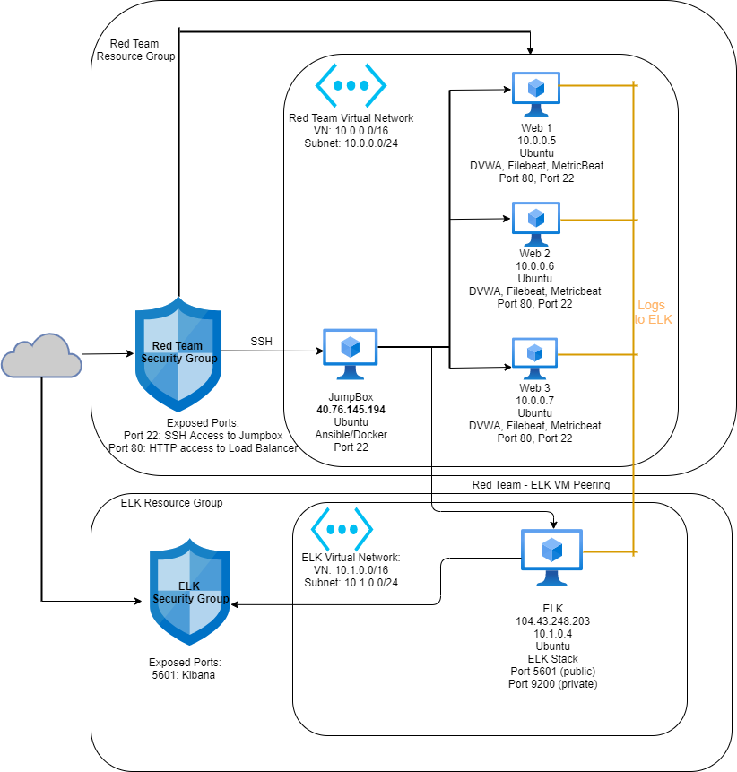

# CyberSecurityProject1
## Automated ELK Stack Deployment

The files in this repository were used to configure the network depicted below.

These files have been tested and used to generate a live ELK deployment on Azure. They can be used to either recreate the entire deployment pictured above. Alternatively, select portions of the filebeat_playbook.yml file may be used to install only certain pieces of it, such as Filebeat.

This document contains the following details:
- Description of the Topology
- Access Policies
- ELK Configuration
  - Beats in Use
  - Machines Being Monitored
- How to Use the Ansible Build

### Description of the Topology

The main purpose of this network is to expose a load-balanced and monitored instance of DVWA, the D*mn Vulnerable Web Application.

Load balancing ensures that the application will be highly available, in addition to restricting access to the network.

Integrating an ELK server allows users to easily monitor the vulnerable VMs for changes to the log files and system resources.

The configuration details of each machine may be found below.
_Note: Use the [Markdown Table Generator](http://www.tablesgenerator.com/markdown_tables) to add/remove values from the table_.

| Name     | Function   | IP Address | Operating |
|----------|------------|------------|-----------|
| Jumpbox  | Web Server | 10.0.0.4   | Ubuntu    |
| Web1     | Web Server | 10.0.0.5   | Ubuntu    |
| Web2     | Web Server | 10.0.0.6   | Ubuntu    |
| Web3     | Web Server | 10.0.0.7   | Ubuntu    |
| Project1 | Elk Stack  | 10.1.0.4   | Ubuntu    |

### Access Policies

The machines on the internal network are not exposed to the public Internet. 

Only the jumpbox machine can accept connections from the Internet. Access to this machine is only allowed from the following IP addresses:
- 174.211.105.0 

Machines within the network can only be accessed by the jumpbox.
Jumpbox:
Public IP: 52.168.1.245 
Private IP: 10.0.0.4

A summary of the access policies in place can be found in the table below.

| Name          | Publicly Accessible | Allowed IP Addresses |
|---------------|---------------------|----------------------|
| Jump Box      | Yes                 | 10.0.0.4             |
| Web1          | No                  | 10.0.0.5             |
| Web2          | No                  | 10.0.0.6             |
| Web3          | No                  | 10.0.0.7             |
| Project1(Elk) | Yes                 | 10.1.0.4             |

### Elk Configuration

Ansible was used to automate configuration of the ELK machine. No configuration was performed manually, which is advantageous because it allows 
What is the main advantage of automating configuration with Ansible? Allows for installations, configuring and updates to servers to be streamlined and allows for automation on repeated daily tasks. 

The playbook implements the following tasks:
In 3-5 bullets, explain the steps of the ELK installation play. E.g., install Docker; download image; etc.
-Installs docker.io,pip3, docker python module
-Increase Memory/Use More Memory we use to run the ELK server
-Uses sysctl module
-Download and Launch ELK Container

The following screenshot displays the result of running `docker ps` after successfully configuring the ELK instance.

### Target Machines & Beats
This ELK server is configured to monitor the following machines:
10.0.0.5
10.0.0.6
10.0.0.7
10.1.0.4

We have installed the following Beats on these machines:
FileBeat and MetricBeat

These Beats allow us to collect the following information from each machine:
Filebeat is a lightweight shipper for forwarding and centralizing log data. Installed as an agent on your servers, Filebeat monitors the log files or locations that you specify, collects log events, and forwards them either to Elasticsearch or Logstash for indexing.  Metricbeat is a lightweight shipper that you can install on your servers to periodically collect metrics from the operating system and from services running on the server. Metricbeat takes the metrics and statistics that it collects and ships them to the output that you specify, such as Elasticsearch or Logstash.

### Using the Playbook
In order to use the playbook, you will need to have an Ansible control node already configured. Assuming you have such a control node provisioned: 

SSH into the control node and follow the steps below:
- Copy the configuration file from your ansible container to your Web VMs.

- Update the /etc/ansible/hosts file to include the IP address of the ELK server VM and webservers

- Run the playbook, and navigate to http://[your_elk_server_ip]:5601/app/kibana to check that the installation worked as expected.

-Which file is the playbook? /etc/ansible/filebeat-config.yml

-Where do you copy it? /etc/filebeat/filebeat.yml

- Which file do you update to make Ansible run the playbook on a specific machine? How do I specify which machine to install the ELK server on versus which to install Filebeat on?
filebeat-config.yml 
updating the host files with ip addresses of web/elk servers and selecting which group to run on in ansible

- Which URL do you navigate to in order to check that the ELK server is running?
http://[your-ELK-VM-External-IP]:5601/app/kibana

